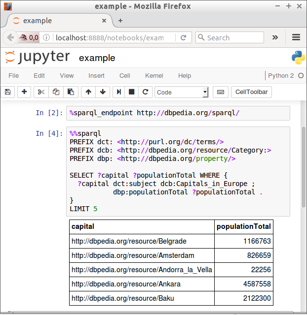

# IPython Sparql Extension

IPython extension for SPARQL integration.



## Install
Via pip:

```bash
pip install ipython-sparql
```

## Usage

It loads the extension:

```
%load_ext ipython_sparql
```

It defines the sparql endpoint:

```
%sparql_endpoint http://dbpedia.org/sparql/
```

Query ;)
```sparql
%%sparql
PREFIX dct: <http://purl.org/dc/terms/>
PREFIX dcb: <http://dbpedia.org/resource/Category:>
PREFIX dbp: <http://dbpedia.org/property/>

SELECT ?capital ?populationTotal WHERE {
    ?capital dct:subject dcb:Capitals_in_Europe ;
             dbp:populationTotal ?populationTotal .
}
LIMIT 5
```

## All magics commands

* %sparql_endpoint: set the sparql endpoint
* %%sparql: query
* %sparql_last_result: returns the last result
